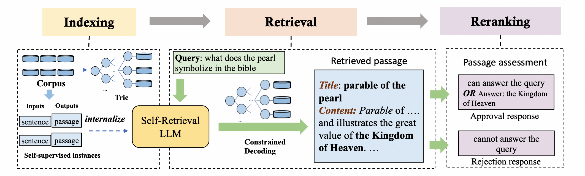

# [NeurIPS 2024] Self-Retrieval: End-to-End Information Retrieval with One Large Language Model
## What is Self-Retrieval?


**Self-Retrieval** is an end-to-end LLM-driven information retrieval architecture that unifies indexing, retrieval, and reranking in a single LLM:
- Indexing: Self-Retrieval internalizes the entire corpus into its parameters through self-supervised learning, enabling the model to process passages internally without relying on external indices.
- Retrieval: Given an input query $q$, Self-Retrieval generates relevant passage $p$ using the knowledge embedded within its parameters, which is different from dense retrieval or generative retrieval that rely on embedding or document identifiers as proxies of passage.
- Reranking: After generating passage $p$, Self-Retrieval assesses its relevance to the query $q$ through self-assessment. The output logits provide the basis for reranking candidate passages.
Experimental results demonstrate that Self-Retrieval not only outperforms existing retrieval approaches by a significant margin, but also substantially enhances the performance of LLM-driven downstream applications like retrieval-augmented generation. 

For more information, checkout our [paper](https://arxiv.org/pdf/2403.00801).

## Data Preprocess
- download the original data from [google drive](https://drive.google.com/drive/folders/1GfW0WxQUTnAz0pJ5WRyVFgUhni-yz75f?usp=sharing).
- build indexing data

```bash
export data_dir=../data/NQ
export index_model_path=../models/NQ/index_llama
export model_path=../models/NQ/self_retrieval_llama
export result_dir=../retrieve_outputs/NQ/self_retrieval_llama
```

```bash
python mem_dataset.py 
    --data_path ${data_dir}/docs.json
    --output_path ${data_dir}/mem_all.json
    --use_all_sents
    --lower_title 
    --tile_and_prefix_only

python mem_dataset.py 
    --data_path ${data_dir}/docs.json
    --output_path ${data_dir}/mem_3.json
    --random_sent_num
    --lower_title 
    --tile_and_prefix_only
```

- add negative data to the training set
```bash
python add_neg_data.py 
    --data_path ${data_dir}/train.json
    --output_path ${data_dir}/train_neg5.json
    --doc_path ${data_dir}/docs.json
    --neg_num 5
```

- build the training dataset
```bash
python qa_dataset.py
    --qa_path ${data_dir}/train_neg5.json
    --doc_path ${data_dir}/docs.json
    --mem_data_path ${data_dir}/mem_3.json
    --output_path ${data_dir}/mem3_neg5_cfg1_repeat2_llama2.json
    --config_path ./configs/config1.json
    --qa_repeat_times 2
    --eos_token '</s>'
```
## Training

After completing data preprocessing, you can use the scripts `sft.sh` for model training.
```bash
bash sft.sh ${data_dir}/mem_all.json meta-llama/Llama-2-7b-hf ${index_model_path}

bash sft.sh ${data_dir}/mem3_neg5_cfg1_repeat2_llama2.json ${index_model_path} ${model_path}
```
## Evaluation
### Building the Tire
```bash
python gettrie.py \
    --model_path meta-llama/Llama-2-7b-hf \
    --corpus ${data_dir}/docs.json \
    --outfile ${data_dir}/trie.json
```

### Evaluation for Retrieval
- predict
```bash
python predict.py \
    --model_path ${model_path} \
    --trie ${data_dir}/trie.json \
    --corpus ${data_dir}/docs.json \
    --data_path ${data_dir}/test.json \
    --output_dir ${result_dir} \
    --beam_num_for_title 5 \
    --beam_num_for_chunk 10
```
- get the final results
```bash
python get_retrieve_from_generation.py \
    --output_path ${result_dir} \
    --corpus ${data_dir}/docs.json \
    --data_path ${data_dir}/test.json
```

### Evaluation for RAG
```bash
python rag.py \
    --plm ${model_path} \
    --rplm ${model_path} \
    --lower True \
    --testsetfile ${result_dir}/retrieve.json \
    --contextfile ${data_dir}/docs.json
```

## Citation
If you find this work useful for your research, please cite:

```
@misc{tang2024selfretrievalendtoendinformationretrieval,
      title={Self-Retrieval: End-to-End Information Retrieval with One Large Language Model}, 
      author={Qiaoyu Tang and Jiawei Chen and Zhuoqun Li and Bowen Yu and Yaojie Lu and Cheng Fu and Haiyang Yu and Hongyu Lin and Fei Huang and Ben He and Xianpei Han and Le Sun and Yongbin Li},
      year={2024},
      eprint={2403.00801},
      archivePrefix={arXiv},
      primaryClass={cs.IR},
      url={https://arxiv.org/abs/2403.00801}, 
}
```
